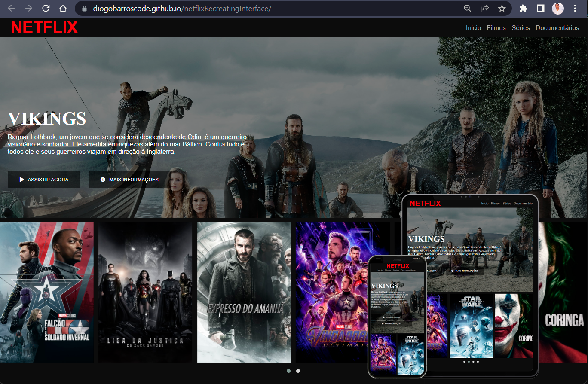

# netflixRecreatingInterface
> Recriando a interface da Netflix

#
## 💬 Sobre
Projeto simples realizado no bootcamp da DIO (Digital Innovation One) mas abordando os vários fundamentos importantes para o frontend como, responsividade e posicionamento dos elementos.

🌐 Click no link para acessar:  [diogobarroscode.github.io/Explorer-Project-NLW](https://diogobarroscode.github.io/netflixRecreatingInterface/)

#
## 🚀 Tecnologias

- HTML
  - Estruturação
  - Tags semânticas
  - Links externos
- CSS
  - Flexbox
  - Variáveis
  - Fontes
  - Cores
  - Media Queries
- JavaScript
  - JQuery
  - Owl Carousel

#
## 📢 Contato

🌐 [linkedin.com/in/diogobarros-code](https://www.linkedin.com/in/diogobarros-code/)

📧 [diogobarros.code@gmail.com](diogobarros.code@gmail.com)
