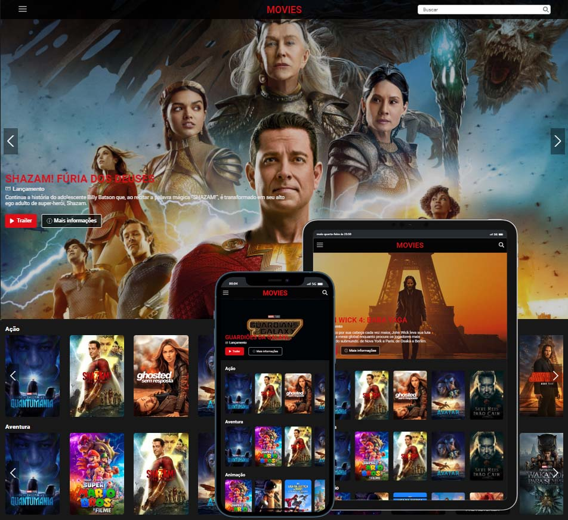

# 🎥 Movies List Project

Projeto idealizado para listar filmes em lançamento e exibir suas informações, bem como os filmes mais populares por categoria. 
Também é possível realizar buscas por qualquer filme que desejar de forma simples.

## Preview

#
## 🌐 Deploy da aplicação:  [(https://movies-list-project.vercel.app/)](https://movies-list-project.vercel.app/)

#
## 🚀 Tecnologias
- Vite
- React
- Axios
- TypeScript
- JSX
- CSS

## 💬 Sobre

📌 Projeto React + Typescript criado com VITE
| npm create vite@latest

📌Também adicionada como dependência ao projeto o React-Router para criação das rotas | npm i react-router-dom

📌 O projeto foi estruturado para realizar requisições a API pública de filmes, séries e TV TMDB com Axios.
Documentação da API: https://developers.themoviedb.org/3/getting-started/introduction

📌 Toda estilização das páginas foi feita com CSS utilizando flexbox para estruturação do layout e media-queries para tornar a página responsiva e compatível com dispositivos móveis.

📌 O projeto também possui duas bibliotecas bastante populares.
- React-Icons para os ícones: https://react-icons.github.io/react-icons/
- Swiper para o carrousel: https://swiperjs.com/react

#

## 💾 Running
📌 Para rodar o projeto na sua máquina basta realizar um git clone com o link do repositório.

📌 Após realizar o clone do projeto basta executar o comando npm install (ou o gerenciador de pacotes da sua preferência) em seu editor de texto para baixar todas as dependências do projeto.

📌 Por fim é só abrir o projeto no browser.

#
## 🔔 Pontos de Melhoria

O projeto está em evolução e precisa de algumas melhorias. Também há algumas funcionalidades que ainda não foram implementadas como:
- Melhorar página individual de filmes.
- Visualização dinâmica ao passar o mouse sobre o card do filme (usabilidade). 
- Páginação nos resultados de busca e na seleção de categorias.
- Menu lateral para versões desktop e mobile.
- Barra de busca dinâmica para a versão mobile.
- Lista de favoritos.
- Integração da Api TMDB com YouTube para visualização de trailers e videos relacionados.
- Adicionar página de carregamento.
- Adicionar página 404 personalizada.

#
## 📢 Contato

🌐 [linkedin.com/in/diogobarros-code](https://www.linkedin.com/in/diogobarros-code/)

📧 [diogobarros.code@gmail.com](diogobarros.code@gmail.com)